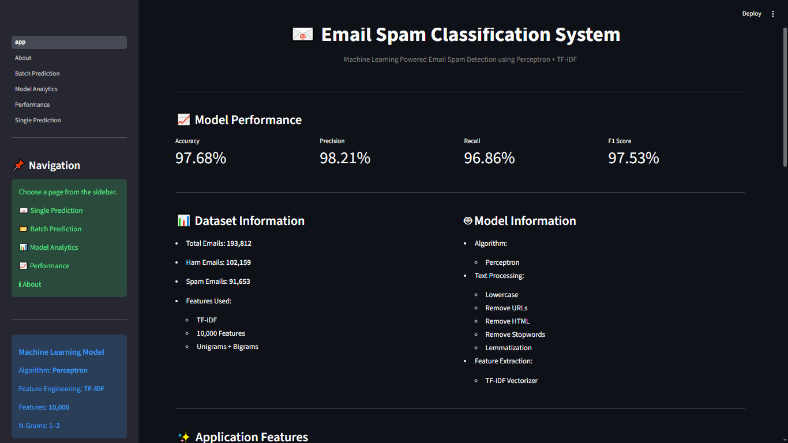
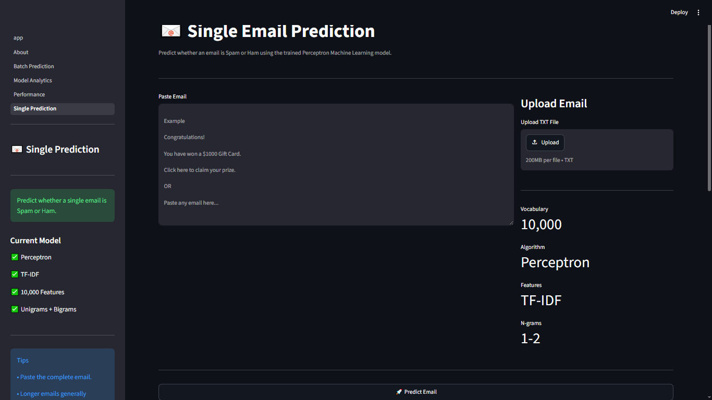
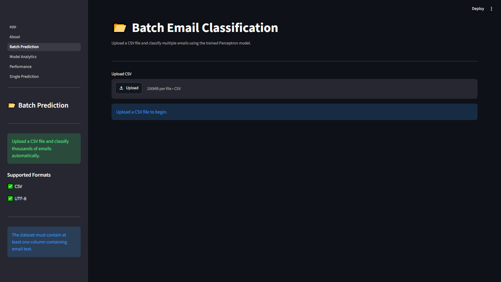

# 📧 Email Spam Classification Using Perceptron

An end-to-end **Machine Learning** and **Natural Language Processing (NLP)** project that classifies emails as **Spam** or **Ham** using the **Perceptron Algorithm**. The project includes data preprocessing, model training, explainable AI, interactive analytics, batch prediction, and deployment with Streamlit.

---

## 📌 Project Overview

Email spam detection is an important text classification problem that helps filter unwanted or malicious emails. This project demonstrates the complete machine learning workflow, from raw text processing to an interactive web application for real-time predictions.

The application enables users to:

* 📧 Predict whether a single email is Spam or Ham
* 📂 Classify multiple emails from a CSV file
* 🧠 Understand why the model made a prediction using Explainable AI
* 📊 Explore the learned model through analytics dashboards
* 📈 View model evaluation metrics and performance
* 📥 Download prediction results

---

## 🎯 Objectives

* Build a binary email classification model using the Perceptron algorithm.
* Apply Natural Language Processing techniques for text preprocessing.
* Transform text into numerical features using TF-IDF.
* Evaluate the model using standard classification metrics.
* Develop an interactive Streamlit application for inference and visualization.

---

## 📚 Dataset

**Dataset:** 190K Spam & Ham Email Dataset

* Total Emails: **193,850**
* Ham Emails: **102,159**
* Spam Emails: **91,691**
* Classification Type: **Binary Classification**

Dataset Columns:

| Column | Description       |
| ------ | ----------------- |
| label  | 0 = Ham, 1 = Spam |
| text   | Email content     |

---

## 🧠 Machine Learning Pipeline

1. Load Dataset
2. Exploratory Data Analysis (EDA)
3. Text Cleaning
4. Text Preprocessing

   * Lowercasing
   * Remove punctuation
   * Remove stop words
   * Remove numbers
   * Stemming
5. TF-IDF Vectorization

   * Maximum Features: **10,000**
   * N-Grams: **(1,2)**
6. Train-Test Split (80/20)
7. Perceptron Model Training
8. Model Evaluation
9. Save Model
10. Streamlit Deployment

---

## 🛠 Technologies Used

* Python
* Streamlit
* Scikit-learn
* Pandas
* NumPy
* Matplotlib
* NLTK
* Joblib


---

## 🚀 Application Features

### 📧 Single Email Prediction

* Predict Spam or Ham instantly
* Decision score
* Confidence score
* Explainable AI
* Most influential words

### 📂 Batch Prediction

* Upload CSV files
* Predict thousands of emails
* Interactive analytics
* Download predictions
* Dataset statistics

### 📊 Model Analytics

* Vocabulary exploration
* Feature importance
* Weight distribution
* Spam vs. Ham learned features
* Search learned vocabulary

### 📈 Performance Dashboard

* Accuracy
* Precision
* Recall
* F1 Score
* Confusion Matrix
* Classification Report

### 🧠 Explainable AI

The application explains each prediction by calculating:

```
Contribution = TF-IDF Value × Model Weight
```

Each word is classified as:

* Spam Feature
* Ham Feature
* Neutral Feature

---

## 📊 Model Performance

| Metric    | Score      |
| --------- | ---------- |
| Accuracy  | **97.68%** |
| Precision | **98.21%** |
| Recall    | **96.86%** |
| F1 Score  | **97.53%** |

The model achieved excellent performance on the testing dataset, demonstrating strong capability in distinguishing spam from legitimate emails.

---

## ▶️ Installation

Clone the repository:

```bash
git clone https://github.com/21Oli/Email-Spam-Classification.git
```

Move into the project directory:

```bash
cd Email-Spam-Classifier
```

Install dependencies:

```bash
pip install -r requirements.txt
```

Run the Streamlit application:

```bash
streamlit run app.py
```

---

## 📷 Screenshots

# Home Page



---

# Single Prediction



---

# Batch Prediction



---


## 🔮 Future Improvements

* Compare with Logistic Regression, Naive Bayes, SVM, and Random Forest.
* Explore deep learning models such as LSTM and Transformers.
* Support multilingual spam detection.
* Build a REST API for real-time inference.
* Add continuous model retraining with new labeled emails.
* Deploy using Docker and cloud platforms.

---

## 👨‍💻 Author

**Oli Bakala**

**Program:** Data Science and Artificial Intelligence

This project was developed as part of a Machine Learning assignment to demonstrate practical skills in text classification, NLP, explainable AI, model evaluation, and deployment using Streamlit.

---

## ⭐ If you found this project useful

If this repository helps you learn about Machine Learning, NLP, or Streamlit, consider giving it a ⭐ on GitHub.
